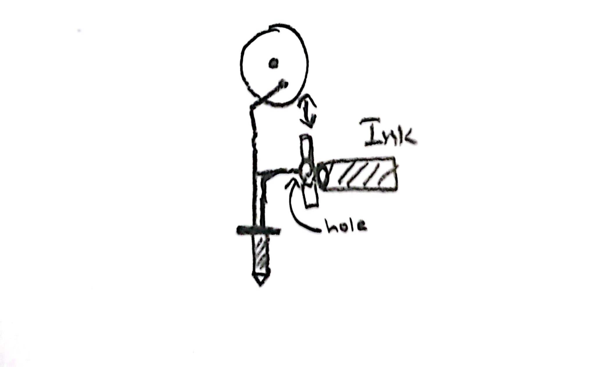
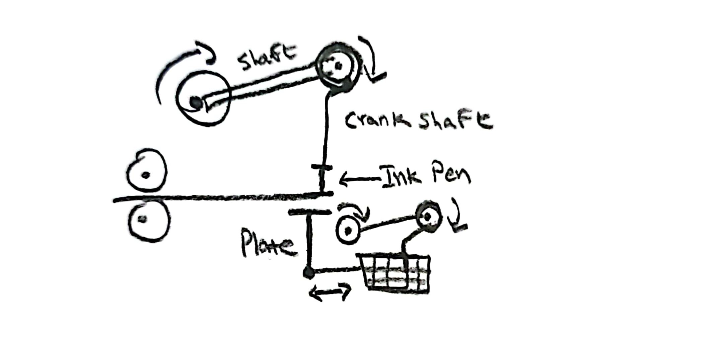
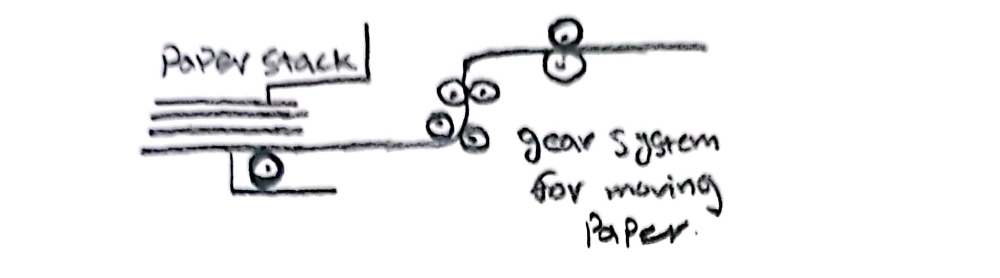

## Clock Design Draft

For the first draft of what the clock can be I wanted to incorporate elements from the sewing machine and ink jet printer I analysed for last week. 
The clock would be a sort of printer where paper will be passed through the machine and a pen attaced to a needle sewimg like contraption will come down and drawn 
random lines or put random dots on the paper creating designs in the process. multiple ink pen contraptions can be added for more varity. There will also be a side to side moving contraption that will help the ink contaptions move horizontally across the paper while the paper is pushed vertically

#### Quarter hour activity 

The paper will pass through and 1 of the ink contraptions will add random dots onto the paper 

#### Half hour activity 

The paper will pass through and 2 of the ink contraptions will be used. one will add random dots while the other will add random lines 

#### Full hour activity 

The paper will pass through and 3 - 4 of the ink contraptions will be used. each one will be randomly assigned either dot or line to and all the ink contraptions 
will then make random lines or dots onto the paper

## Sketches 

The mechanism for how the ink might go into the needle or pen that will draw. A plate with a whole in it will allow ink to pass theough when the ink contraption is at its lowest point. this will allow the ink to last long. MAYBE

The gears and mechanisms to allow the ink contraption to move up and down to make dots or lines. the gears will slow down at one point when the ink is touching the paper to allow it to make line while for dots the gears will continously move with a random speed selected. the plate at the bottom will be there to ensure proper contact with the ink as its movement will be the same as the ink (dot or line with same random speed). multiple of these would be there to support each ink contraption

Simple paper moving system with a set of grears directly taken from how printers move paper.

### Additional 

for additional things I want to add LED and speakers. The LED will have a color similar to each ink contraption and will blink off and on depending on if the ink contaption is doing dot or line designs. IDK what exactly to do with speakers but might play some nice jingle for each quarter / half / full hour activity. 
